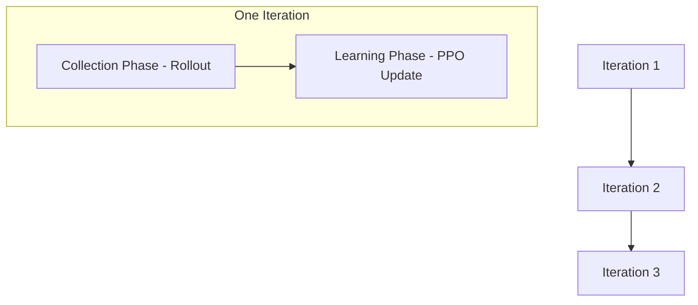
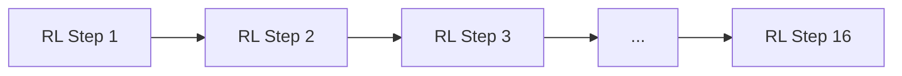
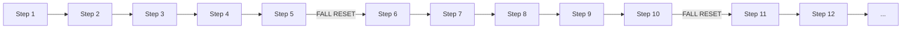
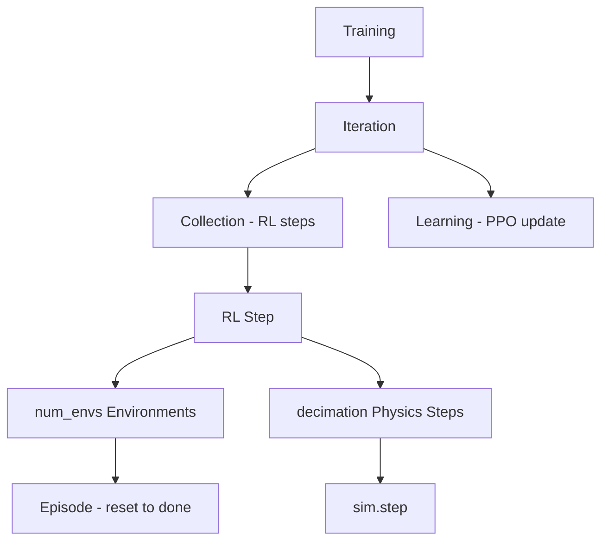

# Two-Wheeler RL Training Structure

> **To render in mermaid.live:** Copy ONLY the content between the backticks (not including the ` ```mermaid ` line). Paste into https://mermaid.live

## Hierarchical Overview



## Iteration Detail: Collection Phase



## Episode vs Rollout (Single Environment)



## Hierarchy Summary



## Key Quantities

| Term | Meaning |
|------|---------|
| **Iteration** | One collect + learn cycle |
| **RL Step** | One policy decision per env |
| **Episode** | One trajectory: reset until termination or timeout |
| **Physics Step** | One `sim.step(dt)` |
| **step_dt** | `sim.dt × decimation` (time per RL step) |

---

*View this file in VS Code with a Mermaid extension, or paste the code blocks into [mermaid.live](https://mermaid.live) to render.*
